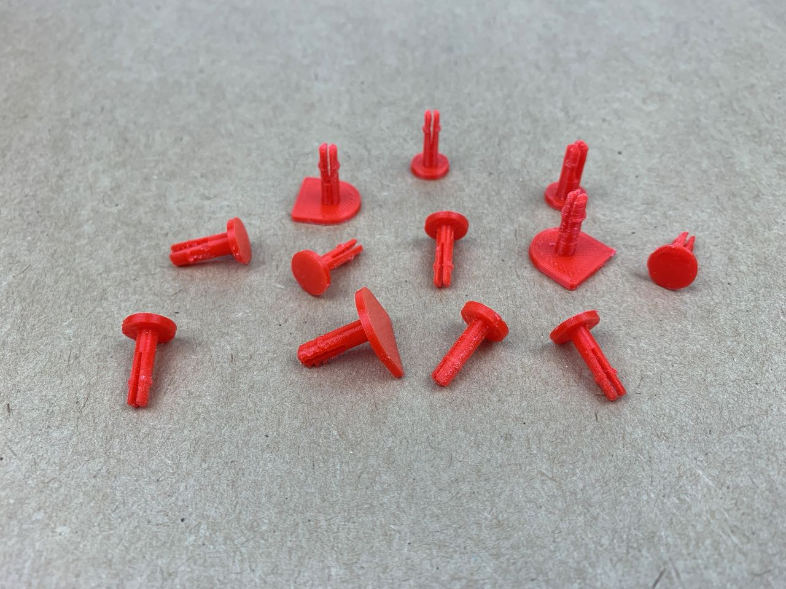
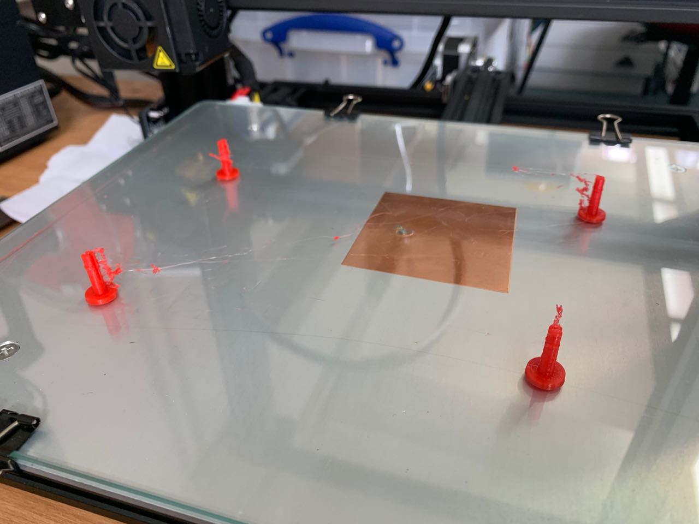
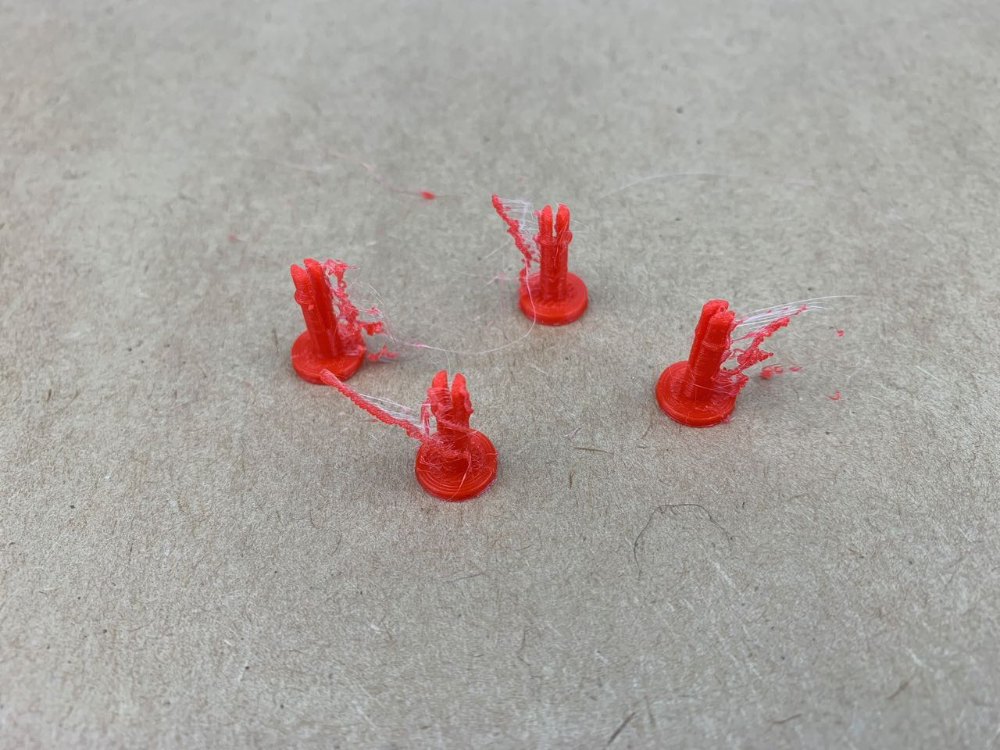
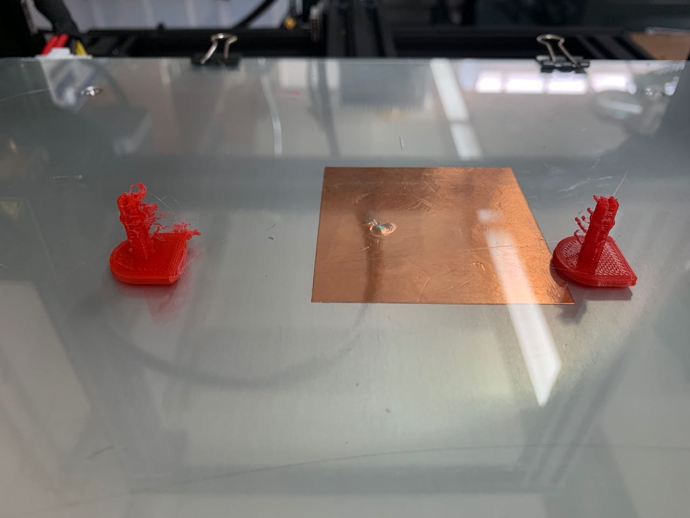
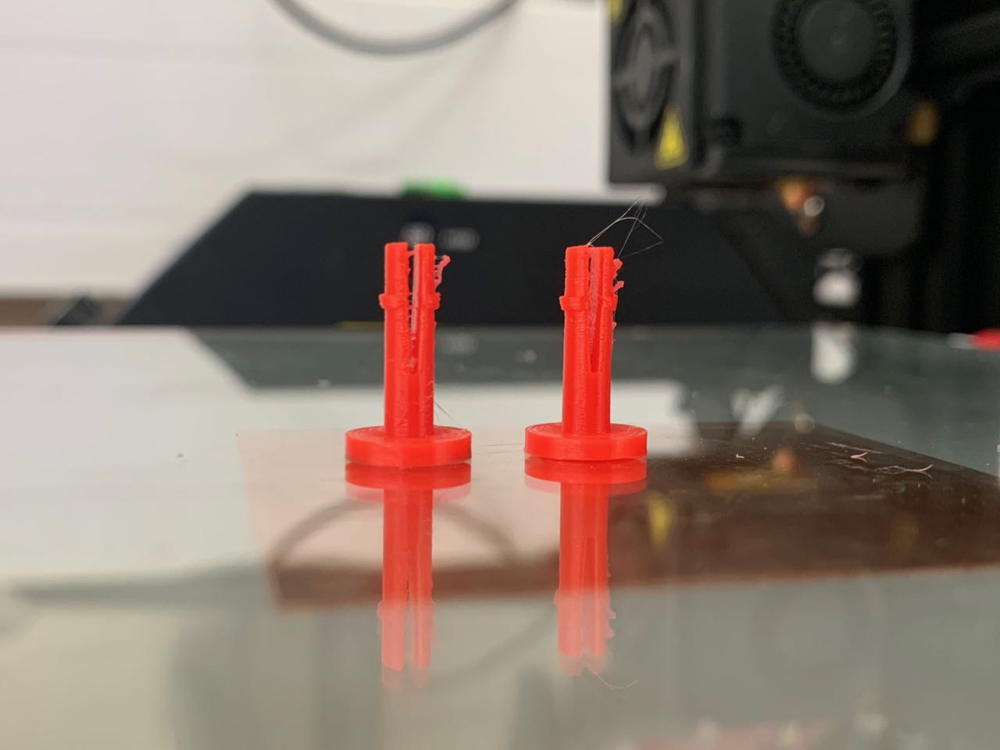

# 3D Printing — Pegs Links and Clips

Plastic connectors are ubiquitous in mass manufacturing, as clips, flexures, screws, etc. 

They’re useful in this context because they can enable simplification of the manufacturing process. Supplying [mono-materials](https://sustainabledesigncards.dk/mono-material/) for assembly by the end user is easier to fabricate, allows for adaptation and repair, as well as better disassembly and recycling.

However while these are easy to manufacture by processes such as injection moulding, they're tricky to make using digital fabrication tools. 

## Some initial experiments
### Links

3D printed PLA, and also a test with laser-cut plywood

### Mating fasteners

These make use of a ridge in the male part and a flexure in the female part, however, this particular test was too weak and snapped quickly.

### Clip links

An early test making a flexible link to tie too layers of fabric together. This shows some promise, though perhaps it would be worth trying some materials other than PLA.

### Pegs

For the pegboard pocket. Again, these make use of a ridge and flexure to allow the peg to be inserted, but hold tight against the back of the pegboard. They do work, but could they stand up to repeated use?

## Viable fabrication
While one part can be printed in reasonable prototyping quality in about 30 minutes, quality, print time, finishing work, and probably mechanical properties are all inadequate for any kind of batch fabrication process.

### Printing more than one at once  

The CR-10 printer has a large print head, which makes sequential printing tricky. (I need to look further into this.) So I’m trying to print multiple copies at once, layer by layer. This results in bad ‘stringing’ artefacts. 

After some research, I’m adjusting print settings to see if this can be improved.

Sources:
* [Stop the stringing with Retraction! 3D Printing 101 - YouTube](https://www.youtube.com/watch?v=XZTBSJAswbs)
* [How to fix stringing - Ultimaker](https://ultimaker.com/en/resources/19504-how-to-fix-stringing)

I tried these changes, with only a small improvement:

* Retraction: increased from 5 to 10 mm
* Coasting: switched on
* Wiping between layers: switched on

Then I tried adjusting temperature and speed settings:

* Nozzle temperature: from 210 to 180 °C
* Bed temperature: from 70 to 60 °C
* Print speed: from 40 to 20 mm/s
* Travel speed: from 150 to 200 mm/s

This made a much bigger difference to quality, though it did also slow down print time. These two pegs (approx 15 mm high) took 20-30 minutes to print:

They still need cleanup after printing, but this an improvement. 

In the meantime, I’m also looking at other ways to fabricate these parts, specifically milling a pre-mould, casting a silicone mould and then casting resin parts from that.
