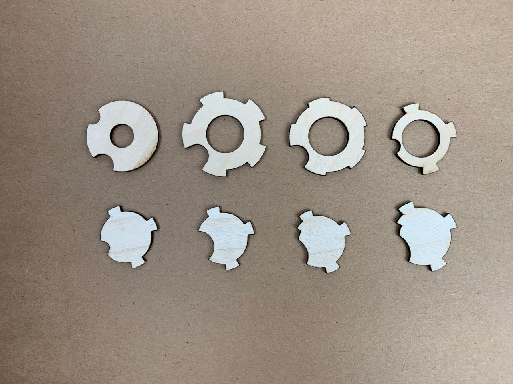
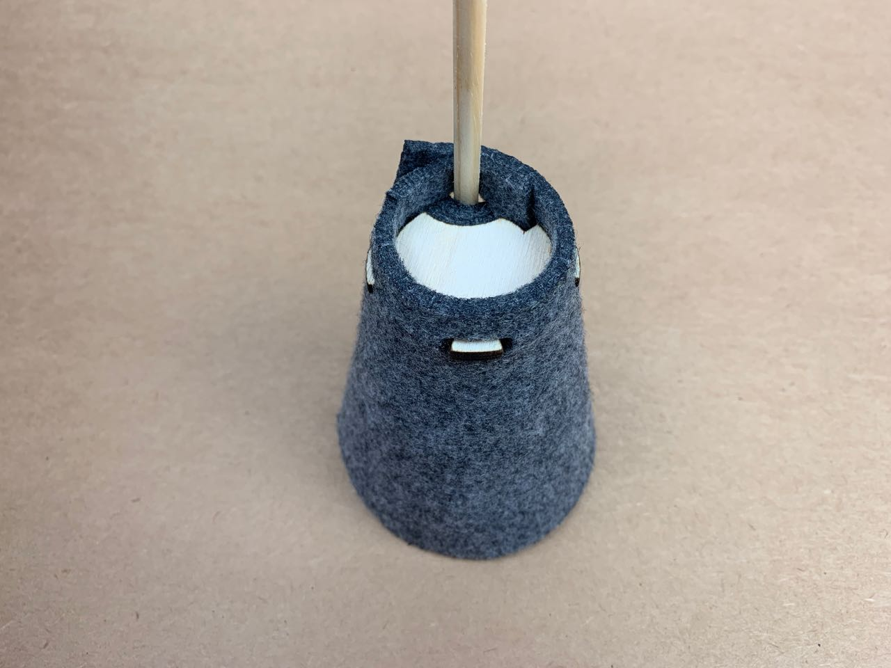
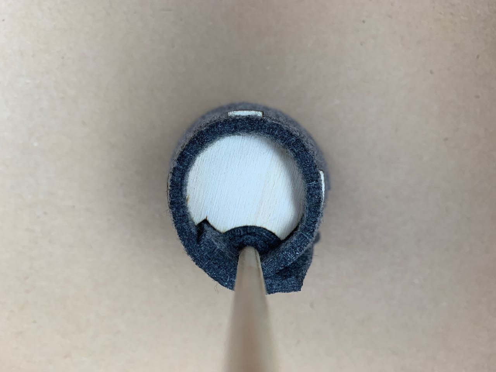

# Assembly — Circular Key

This key is designed to provide a rigid circular frame around which fabric can be wrapped, and to lock it in place with tabs that protrude through slots cut in the fabric.

I used 3mm birch plywood

Laser settings: 

|    Speed| 10 %     |
|    Power | 70 %     |
| Frequency | 2500 Hz |

I experimented with different styles to accommodate (in different permutations) a lamp holder, a different numbers and height of tabs, cutouts for the dowel rod, and for overlapping fabric. 

With stiffened felt in articular, the key forms a strong hold. 

The image below shows the affordances made for the distortion in the fabric caused by the dowel rod, and the extra thickness in one area caused by the overlap.

