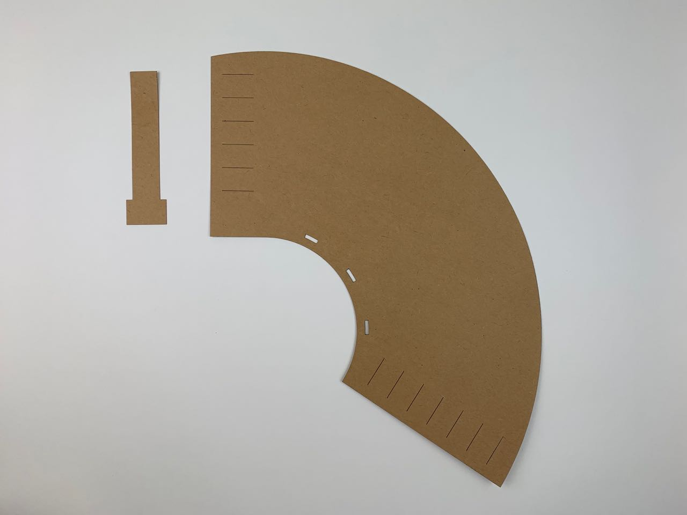
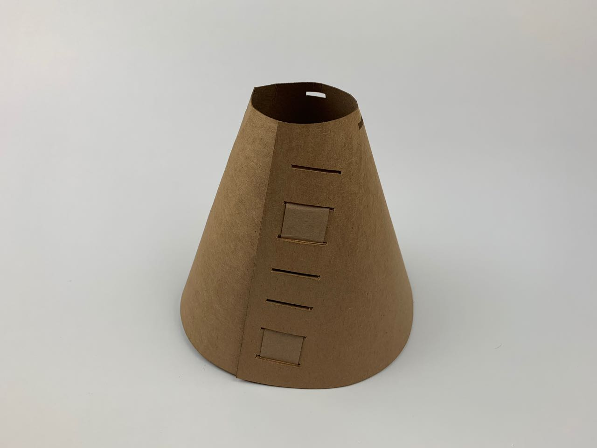

# Card — Article — Cone Lampshade

This [325 gsm card](https://www.seawhite.co.uk/Catalogue/SURFACES-MOUNTING/Card/Kraft-Card/Recycled-Kraft-Card-325gsm-CDRNASA2) is flexible and springs back to shape, so I tried making a variant of the cone lampshade, using a flat card ribbon instead of a dowel rod to tie the ends together.

With some care I think good results could be achieved, but in this case I found it creased too readily. 

This joint methods also requires wider slots than this pictured in the first picture; I widened them with a craft knife after laser-cutting the template. 

