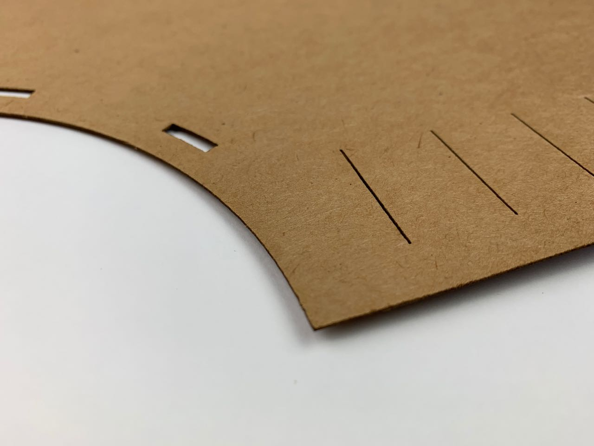

# Card — Cutting

This was all done on the Fablab’s [Epilog Helix](https://www.epiloglaser.co.uk/laser-machines/mini-helix-engraver-cutter/) laser cutter. I’m using 325gsm [Kraft card](https://en.wikipedia.org/wiki/Kraft_paper) made by [Seawhite](https://www.seawhite.co.uk/Catalogue/SURFACES-MOUNTING/Card/Kraft-Card/Recycled-Kraft-Card-325gsm-CDRNASA2).

## Settings
|   Speed   | 100 %  |
|   Power   |  50 %  |
| Frequency | 500 Hz |

That just cut through – it needed a couple of nicks with a knife to release it.

It gives a very good edge quality, with virtually no scorching on either side. Even the edge isn’t as black as laser-cut plywood or MDF

