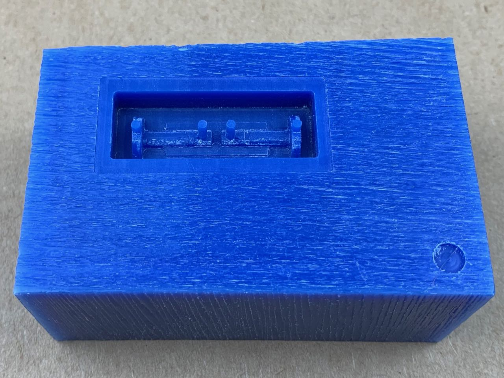
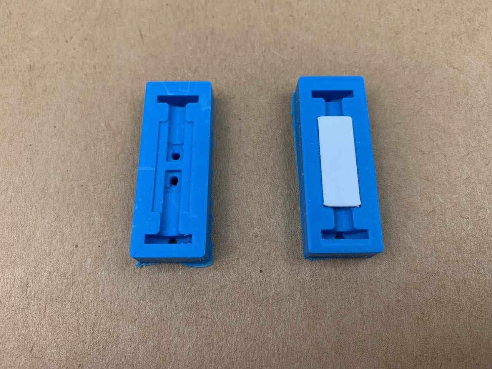
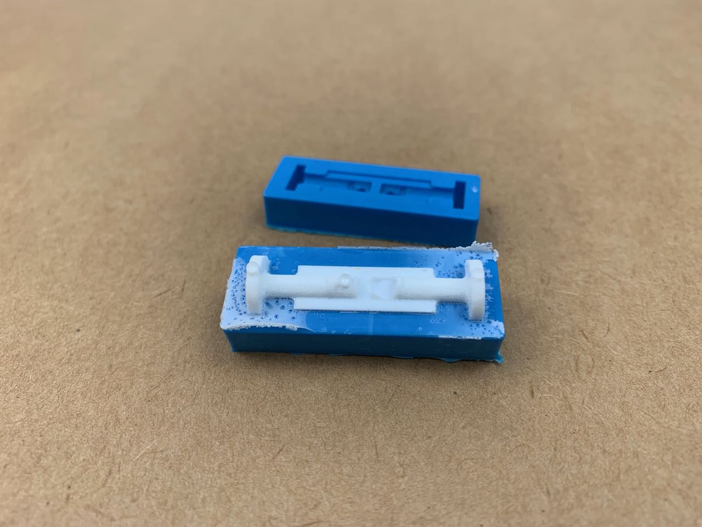
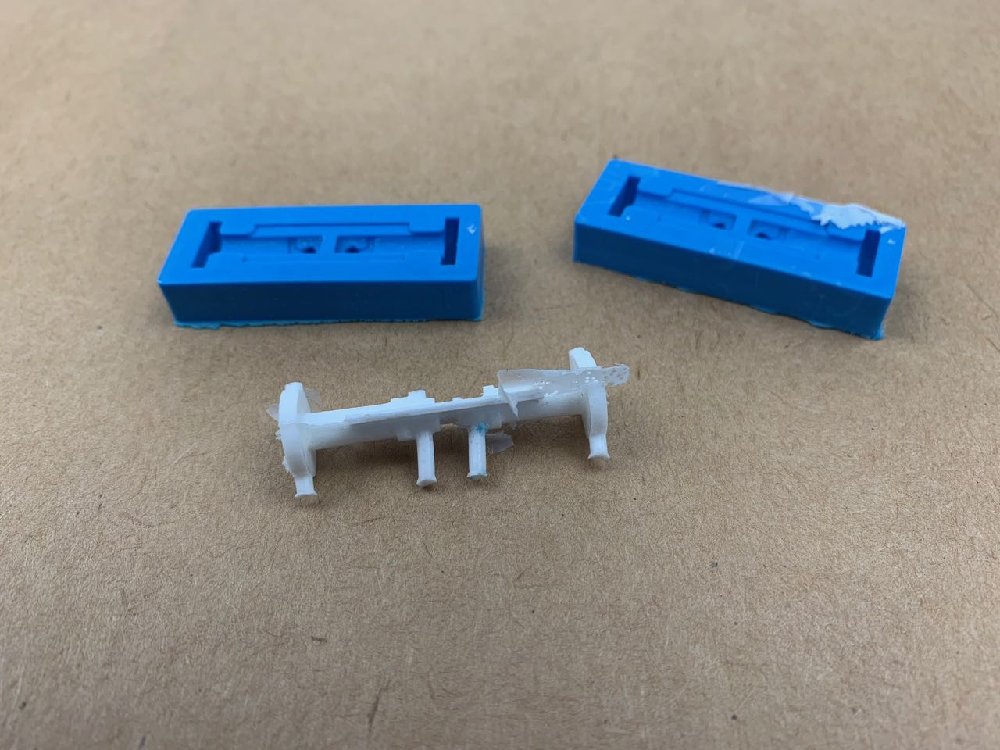
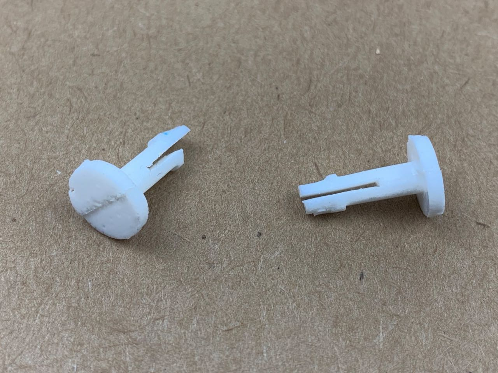

# Casting — Pegs Links and Clips

As an alternative to [3D printing plastic connectors](../3d-printing-pegs-links-and-clips) I wanted to try casting them in resin.

In Fusion 360, I designed a 2-part pre-mould to be milled from wax. The part is a small peg with a 1 mm slot cut in the shaft to allow the two halves to flex and squeeze together. Each (identical) half of the pre-mould features half of the peg (or half of 2 pegs laid out end-to-end) with a 1 mm rectangular raised plane occupying the space of the slot. There are also posts for pour and vent holes in the mould.

The mould is cast from that pre-mould in silicone. I cut a 1 mm thick rectangular section from polypropylene to occupy the area of the slot, and also to act as a key to help with mating the two halves of the mould

The parts themselves were cast from **Smooth-On Smooth-Cast 305**, a white 2-part resin, with a pot time of about 7 minutes and cure time of 30 minutes.

This image shows the two cast pegs before cleanup, still attached to the polypropylene key.

This resin is quite soft, so easy to clean up, however, it was not a good casting. There was some misalignment between the two halves, missing areas where the resin had not filled the mould, and a lot of air bubbles (I don’t have access to a vacuum chamber/degasser, so this is always likely to be a problem).

I think it might be worth trying to cast other parts from resin. I can’t do much about the air bubbles, but I could improve registration, and perhaps with simpler parts, I could avoid gaps. 

This resin is a pretty good fit for this application, but I also have access to another resin, (**Smooth-On Smooth-Cast 326 EU**), which might also work. 
