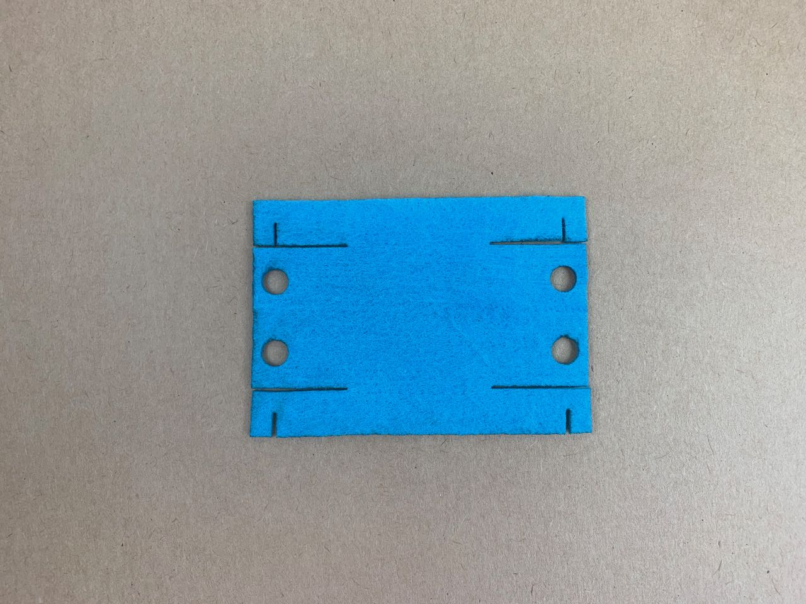
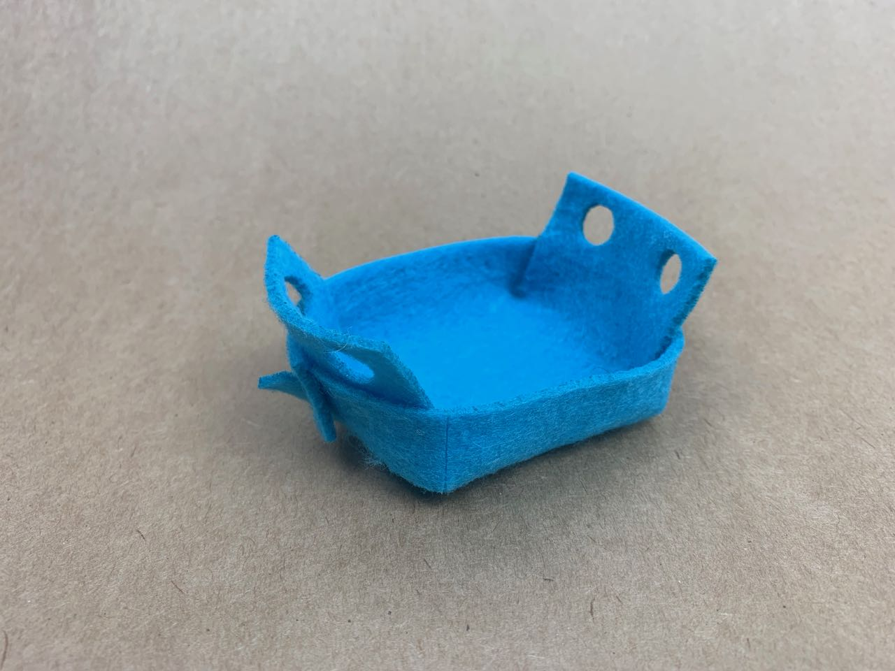
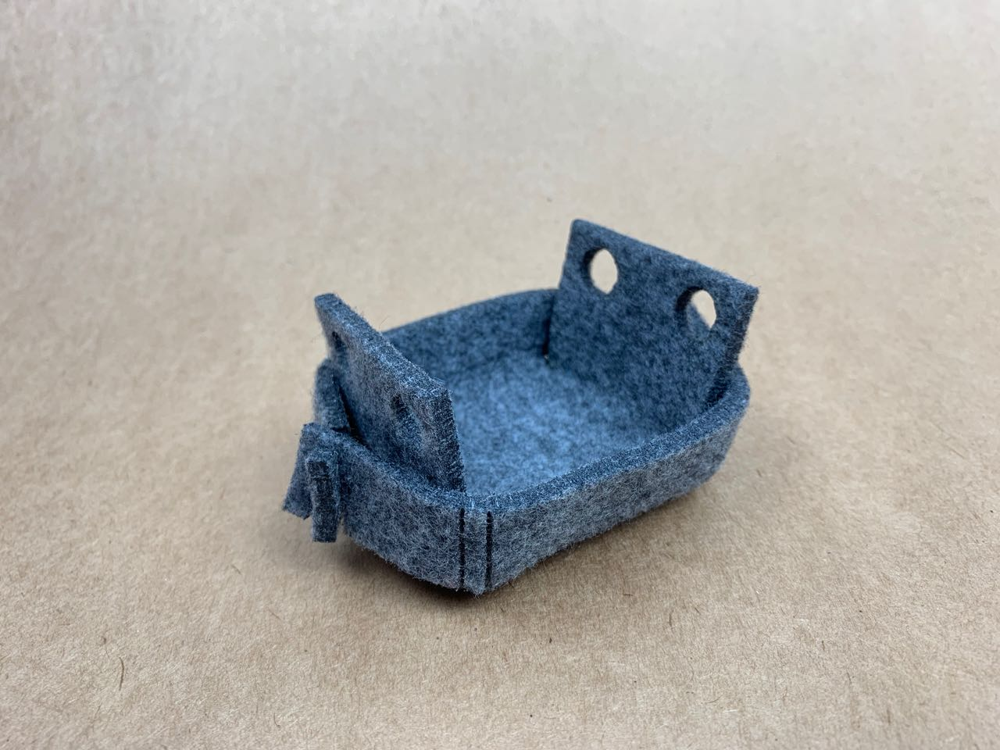
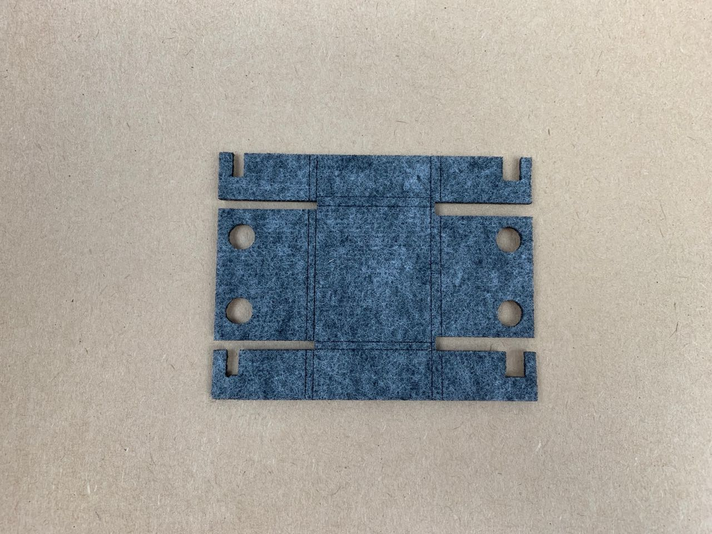
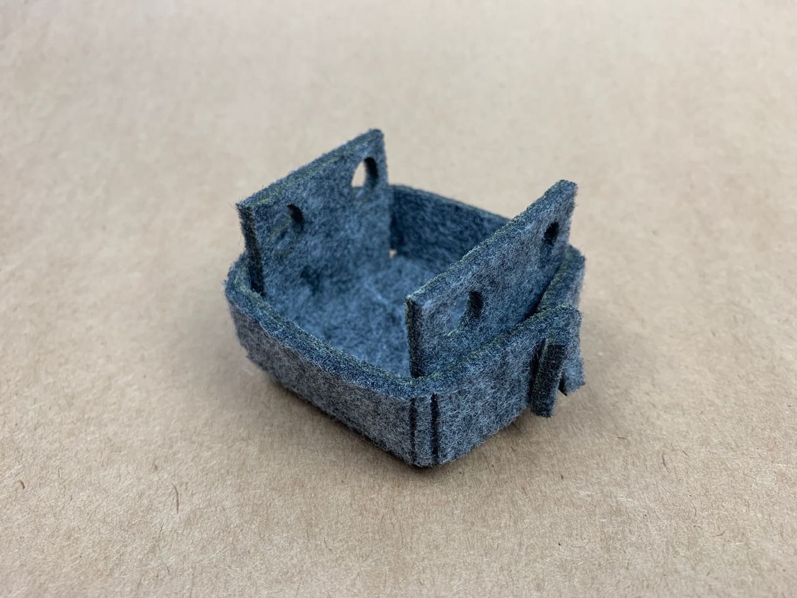
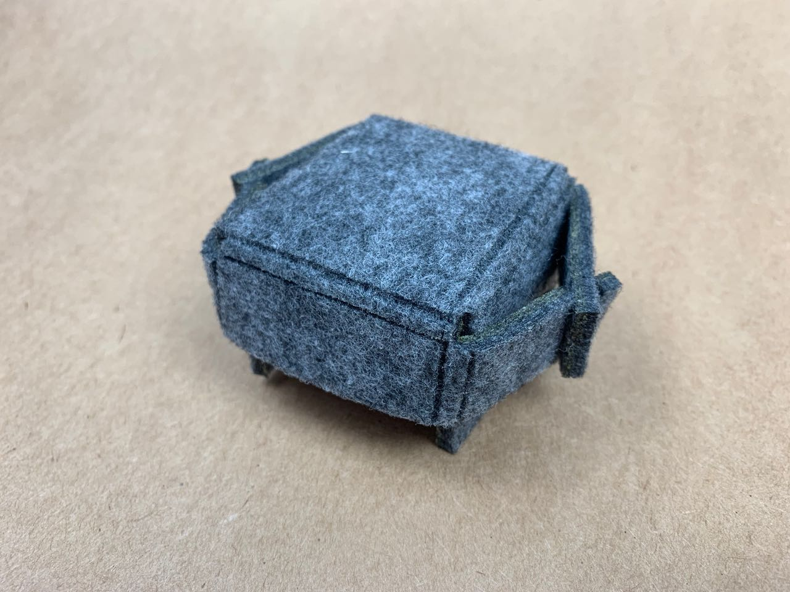
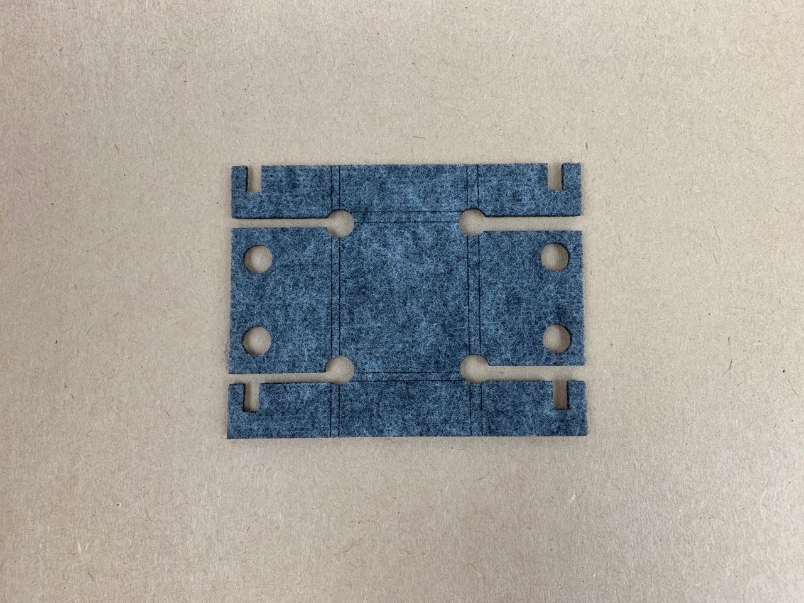
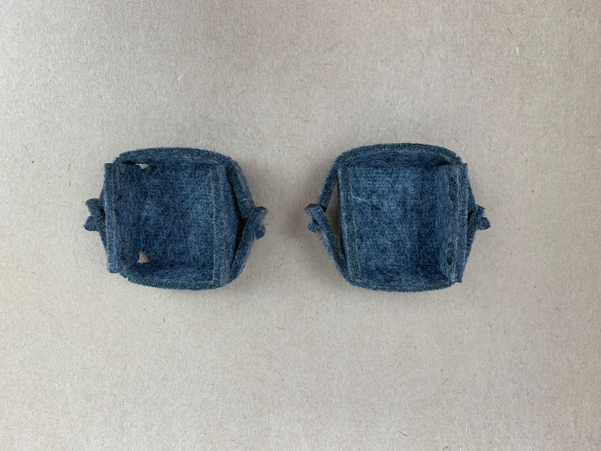

# Felt — Article — Folded Box
I used a simple folding box design to test how well the felt could be cut, folded and joint to form a 3D object. I was looking for easy assembly, clean shapes, and a stable structure.

This design is copied from one featured in the book [The Art of Cutting](https://www.amazon.co.uk/Art-Cutting-Jean-Charles-Trebbi/dp/8415967152), credited to Josh Jakus. 

## Test 1 — Thin Soft Acrylic Felt (1-2 mm)

As expected, this material doesn’t have enough rigidity to make a particularly stable box. However, I suspect felt only slightly thicker (e.g. 3 mm) would work OK.

## Test 2 — Thick Soft Acrylic Felt (5 mm) 

This thicker felt works well, though the stiffness causes the box to deform at this small size. A larger box might work better.

## Test 3 — Thick Stiffened Acrylic Felt (5 mm) 

This felt also works well, and can be worked so that the edges are sharp and the surfaces quite flat. 

## Test 3 — Thick Felt with Corner Cutouts

Box on the left has corner cutouts.

I tried another test cutting out circles around the 4 corners to allow for easier folding, but this didn’t seem to make a huge difference.

## Files

[folding-box-5mm-stiff-felt.eps](folding-box-5mm-stiff-felt.eps)