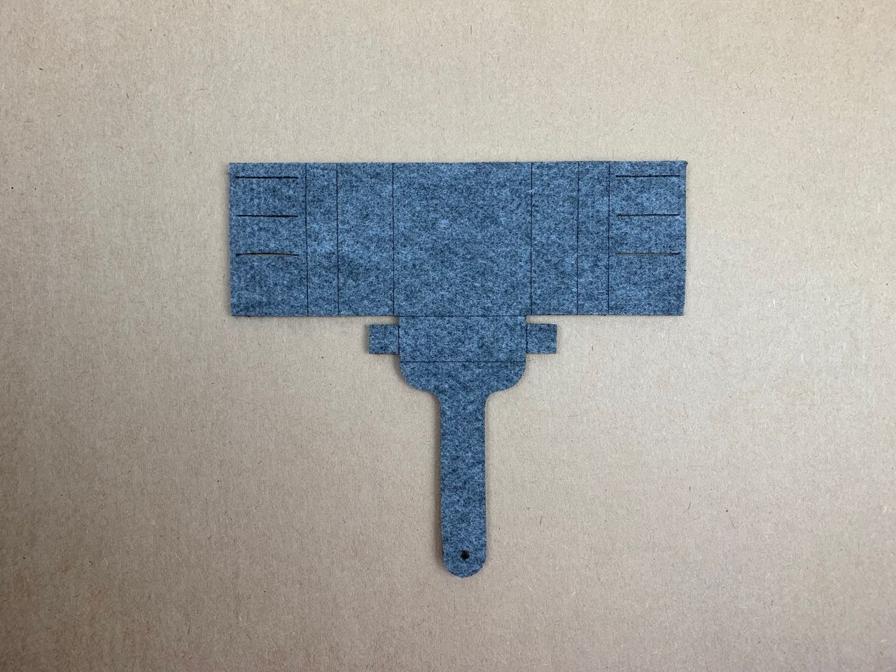
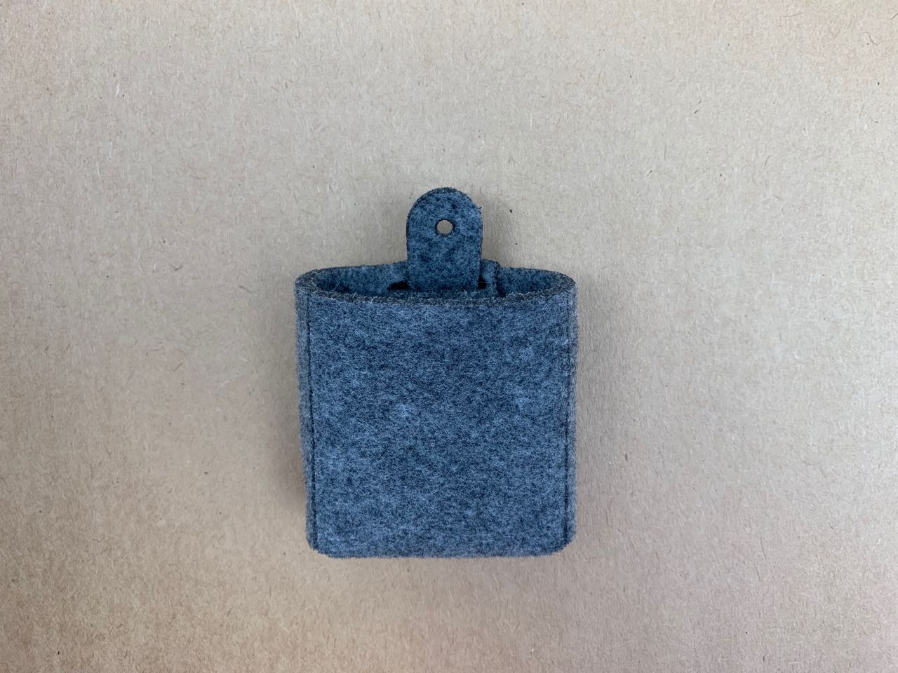
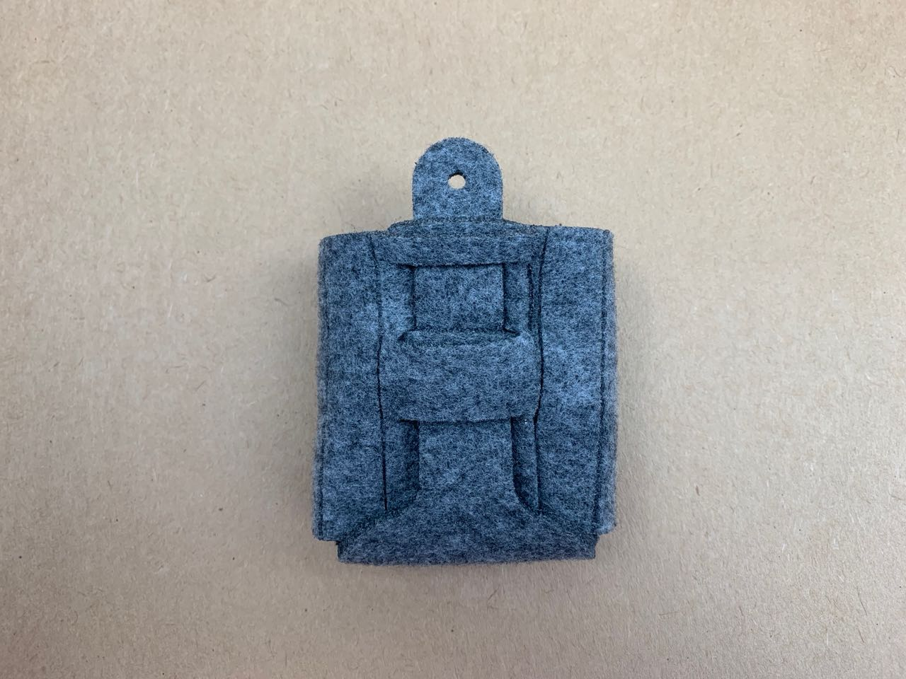
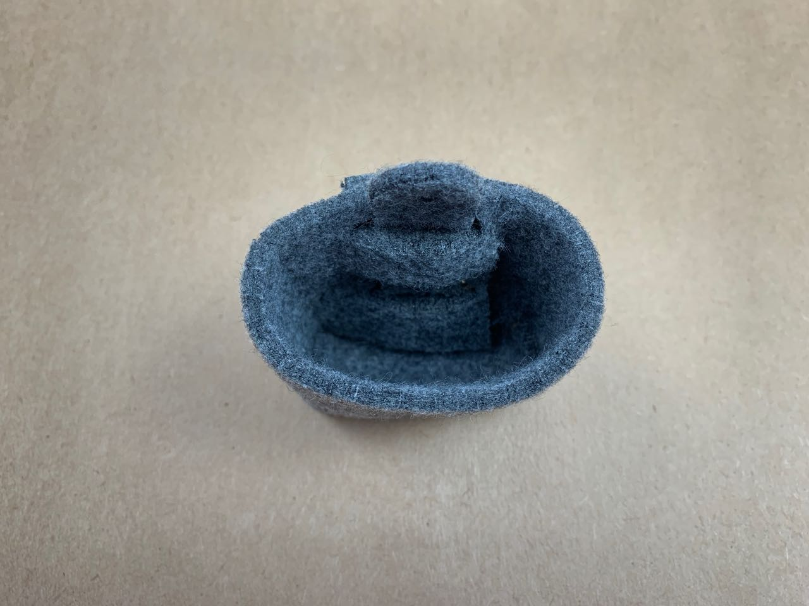

# Felt — Article — Hanging Laced Pocket
A net that folds into a pocket, where the ribbon that ties together the two back faces also supports the weight of the pocket.

This is a nice design that works well in thicker felt. However, the net is inefficient to cut, and also adds bulk to the back of the pocket. 

