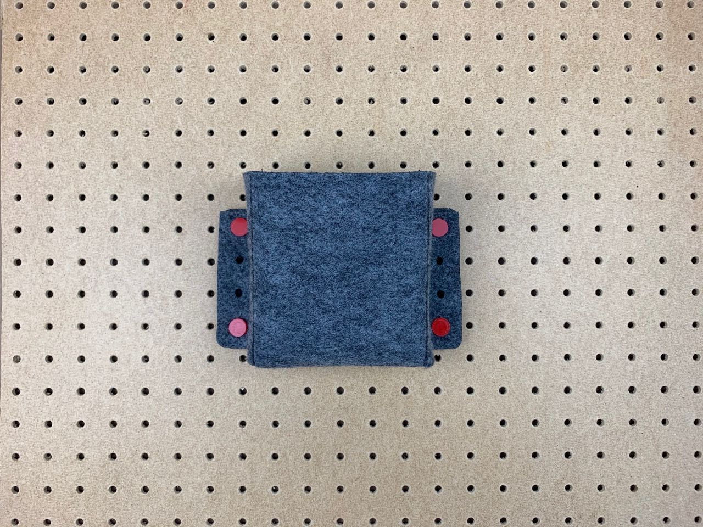

# Felt – Article — Pegboard Pocket
Inspired by Hannah Perner-Wilson’s [Pegboard Fabric Instructable](https://www.instructables.com/id/Pegboard-Fabric/) I wanted to try making a pocket that could be assembled and attached to a surface by pegs.

## Pattern for folded pocket
The pegboard I have has 1/6 inch diameter (approx. 4 mm) holes arranged in a 3/4 inch grid.

## Assembled and mounted to pegboard

## Revised cut pattern
I tried a slight variation on the design where the top fixings are folded in for a more robust pocket.

## Pegs

These are assembled and fixed with pegs that push through holes on both layers of felt, and into the pegboard. The pegs have a small oval-shaped ridge approx 10 mm along the length of the peg that hold the peg against the back of the pegboard. A flexure in the peg allows it to bend, to fit.

I’ve covered fabrication of the pegs elsewhere: 
* [3D Printing – Pegs Links and Clips](../3d-printing-pegs-links-and-clips)
* [Casting — Pegs Links and Clips](casting-pegs-links-and-clips)

## Files

* [pegboard-pocket.eps](pegboard-pocket.eps)
* [pegboard-pocket-2.eps](pegboard-pocket-2.eps)
* [pegboard-peg_4mm-diamter-10mm_length.stl](pegboard-peg_4mm-diamter-10mm_length.stl)
