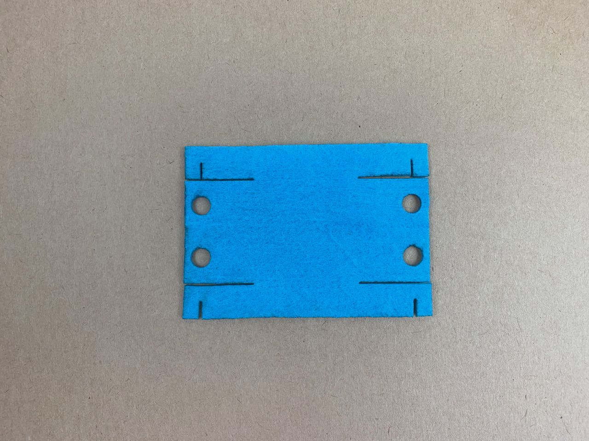

# Felt — Cutting and Scoring
I’ve tried some different settings on the Fablab’s [Epilog Helix](https://www.epiloglaser.co.uk/laser-machines/mini-helix-engraver-cutter/) laser cutter.

## Thin Acrylic Felt (approx. 1-2 mm)

### Cutting
Speed 100 %
Power 50 %
Frequency 5000 Hz

This gives about about 1 mm of kerf.
Some mild scorching on edges, but not too bad.
Small features (e.g. 1 mm across) are lost dues to melting from the laser passing over the same place twice.

### Scoring
Speed 100 %
Power 5 %
Frequency 5000 Hz

For material this thin, scoring isn’t really necessary, but this setting worked fine.

## Thick Soft Acrylic Felt (5 mm)

### Cutting
Speed 100 %
Power 70-90 %
Frequency 5000 Hz

This gives quite a good edge, but there is some roughness from the uneven melting. It might be worth experimenting with slower speeds.

Small features (e.g. 1 mm across) are lost dues to melting from the laser passing over the same place twice.

Also works:
Speed 50 %
Power 30 %
Frequency 5000 Hz
(Imperceptible difference in quality)

### Scoring
Speed 100 %
Power 10-15 %
Frequency 5000 Hz

## Thick Stiffened Acrylic Felt (5 mm)

The same settings as for the soft 5 mm felt worked, but there was some discolouration of the felt from the stiffening agent.

### Smell

All the cut pieces smell terrible. I’m waiting to see if this fades over time. It would be interesting to compare with wool felt. 

