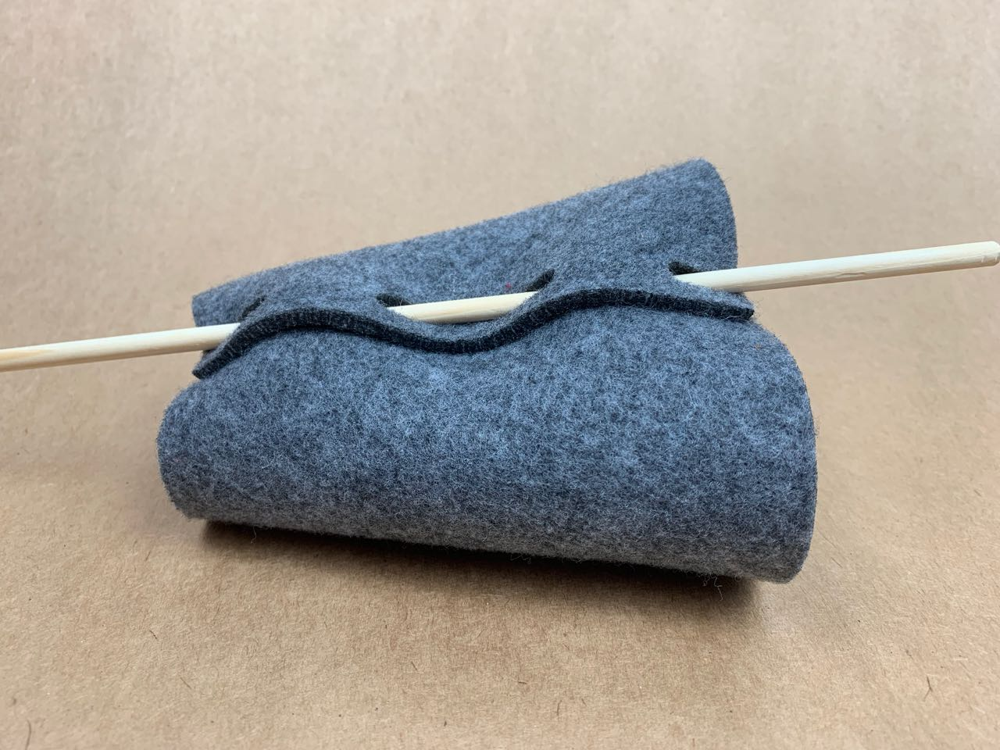

# Felt — Joining — Dowel and Pills
This was my first test threading wooden dowel through pill-shaped holes in layers of felt to join them together.

It has a pleasing appearance, but in some applications the deformation of the fabric would be a problem.

The pills are best offset on each layer to allow an easier, straighter path for the dowel.

