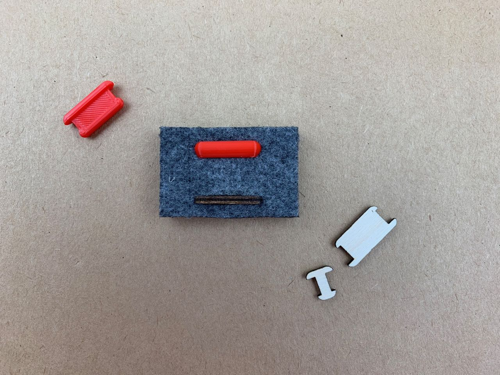

# Felt — Joining — Linking Keys
I tried several versions of this linking key to join two layers of fabric.

The first is 3D-printed in PLA and each end of the key has an overlap all round (like a dog bone shape). The second is laser-cut plywood, so is flat on each face with a locking overlap only at each end. 

Both versions are asymmetrical allowing one side to hold more securely and the other to be inserted more easily.

The 3D-printed keys feel much better to insert and handle, and have a pleasing amount of flexibility (the fabric can be peeled away from the key, and the ease of this could be controlled by sizing the ‘dog bone’ ends differently).

However the 3d-printed key has no flat faces, so it can’t be printed without support, which is slow and adds finishing work for what should be a simple part. 

Its possible a version with a flat face could work OK too.

