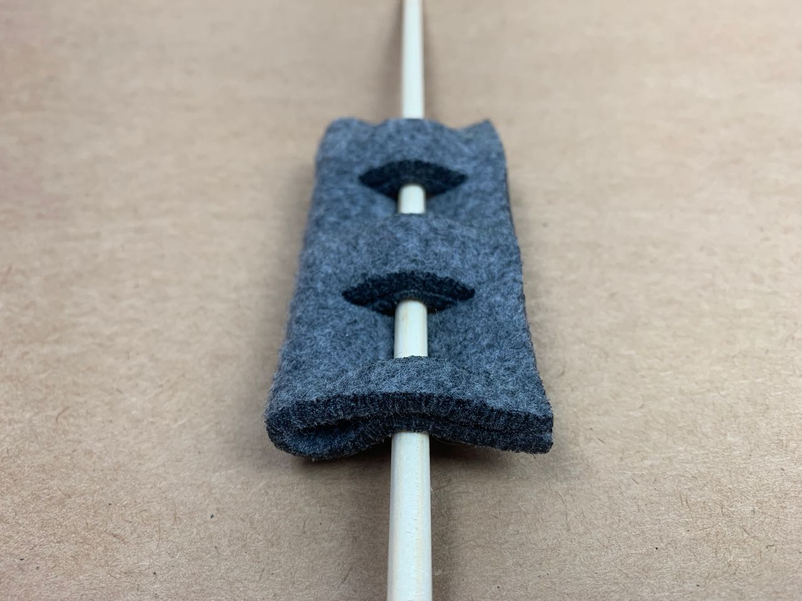

# Joining — Dowel and Slots
Threading the dowel through pill-shaped holes in the felt caused too much distortion of the fabric. Cutting slots across the direction of the dowel allows the fabric to conform with less distortion.

## Test 1 — 6 mm dowel, 12 mm slots

### Result
Due to the thickness of the felt, this method still caused a lot of distortion, so I tried cutting longer slots

## Test 2 — 6 mm dowel, 18 mm slots

### Result
For this thickness and pliability of felt, and using a 6 mm dowel rod, an 18 mm slot gives a good tradeoff between security of the fit and distortion of the material.

## Files

<a href='dowel-slots-test.eps'>dowel-slots-test.eps</a>

