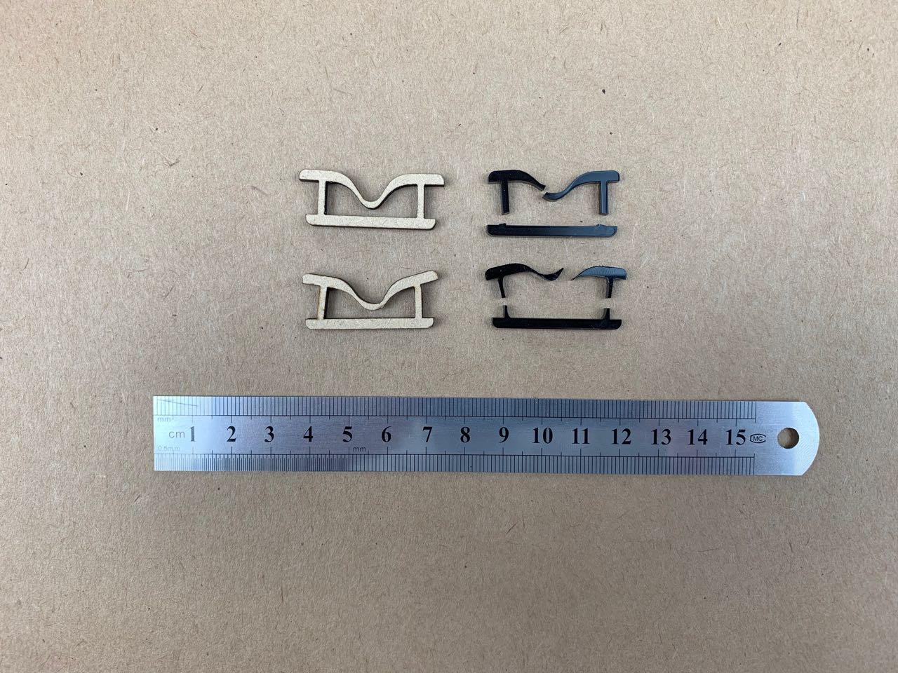
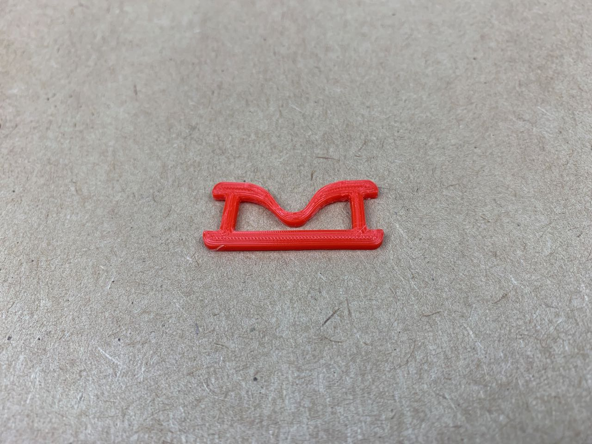

# Joining — Flexure Links

In commercial fabric products like coats and rucksacks, plastic flexible clips are common. They often use a flexure to allow the clip to deform reliably. 

I’m trying to make some simple links with a flexure to allow easy insertion whilst keeping a secure fit. 

In these early experiments I’ve laser cut 3 mm MDF and acrylic. In the first MDF version (top left), the central flexure is too deep, so hits the lower bar when the side bars  are compressed only a small amount. 

The second version (bottom left) addresses this, but the MDF tears when flexed.

I switched to acrylic, but is too brittle in this design. The first version (top right) snapped instantly; the second version (bottom right) which has thinner side posts and central flexure was a little more flexible, but still snapped too quickly.

By comparison, a commercial injection-moulded ABS(?) flexure will last for many thousands of uses.

I tried a quick test 3D-printing the same design in PLA. It is certainly more flexile than MDF or acrylic, but I suspect the behaviour of the flexure will very considerably depending on print density and infill patterns, so more tests are needed here.

## Files

* [3d-print-flexure-1.stl](3d-print-flexure-1.stl)
* [flexure-clip-1.dxf](flexure-clip-1.dxf)
* [flexure-clip-1.eps](flexure-clip-1.eps)