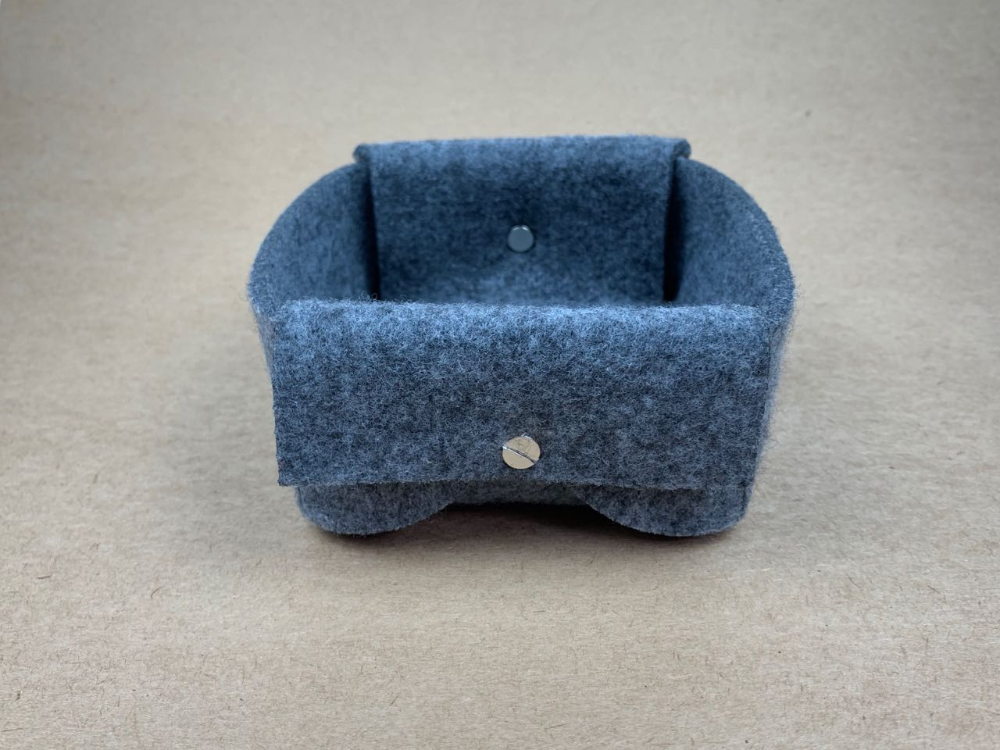
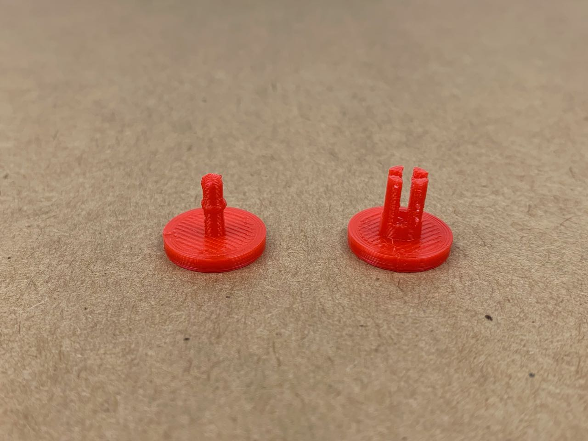

# Joining — Mating fasteners

Brass or steel 2-part mating fasteners are widely available under many names: Chicago screws, screw posts, sex bolts, and more.

I have [these ones from Amazon](https://www.amazon.co.uk/dp/B07CKHY17D/ref=pe_3187911_189395841_TE_dp_1), which have posts of 6, 8 and 10 mm. 

In this soft felt, they are not so good. They’re fiddly to fit; aesthetically, they don’t add anything, and the two materials don’t interact very well: the fasteners are too heavy for this soft, light material; and the metal and felt don’t grip each other. 

They would work better with leather or maybe thick paper stock. 

I’m also experimenting with 3D-printed mating fasteners. This one is about 15 mm diameter, and might work with some refinement, but at the moment, the female post is too fragile and breaks when the male post is removed. 

It could be improved with some adjustments to the fit, to the flexure; the thickness of the posts and the ridge; by considering the printing infill pattern or printing in a more robust or flexible material.

