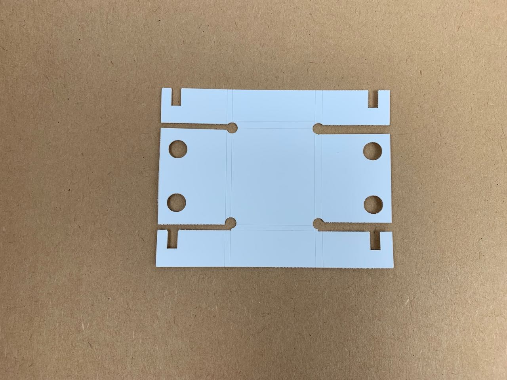
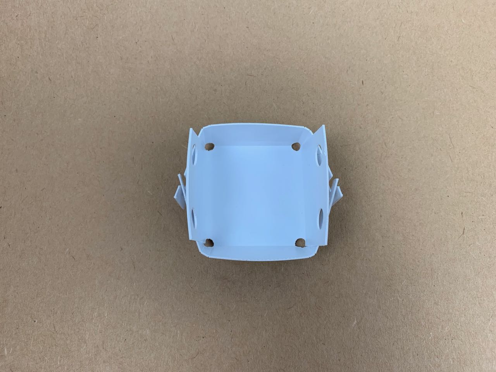
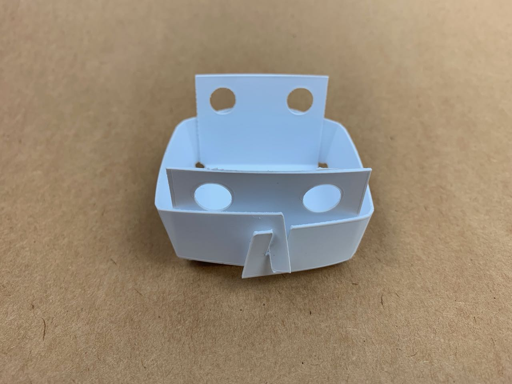

# Polypropylene — Article — Folded Box

Polypropylene scores well, and it can retain a fold, giving nice clean edges, and relatively flat faces.  

The surface is much more slippery than felt, so tabs need a tighter fit to hold the sheet in its folded state. 

This design was unchanged from the one I’d used for 5 mm felt, and the tabs were too loose to hold this box together well.

