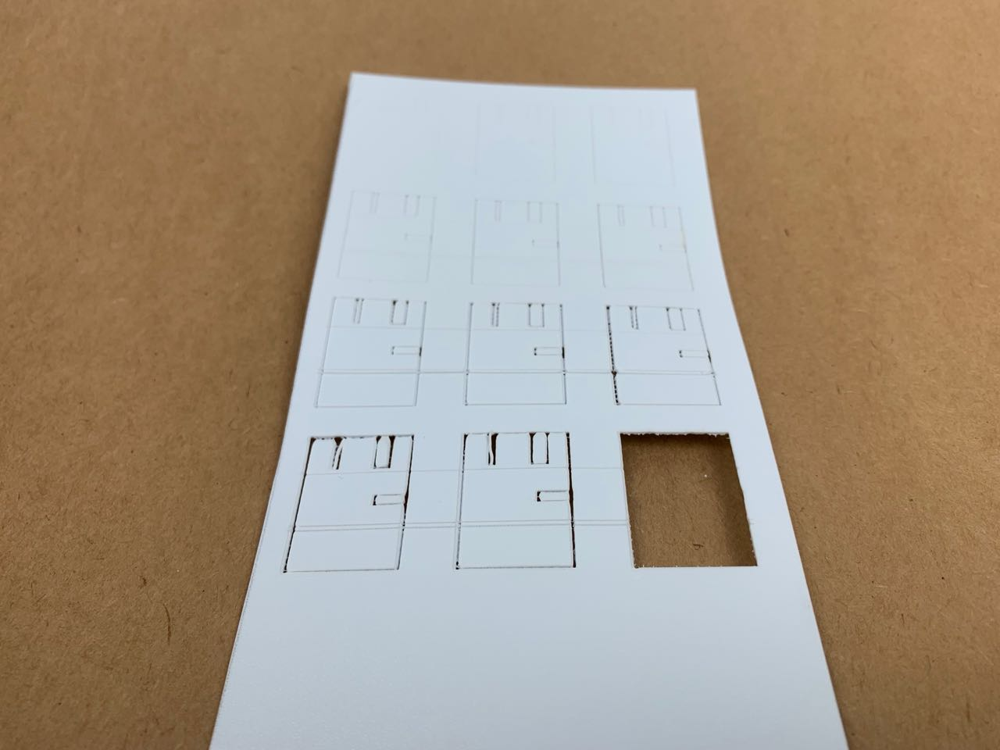
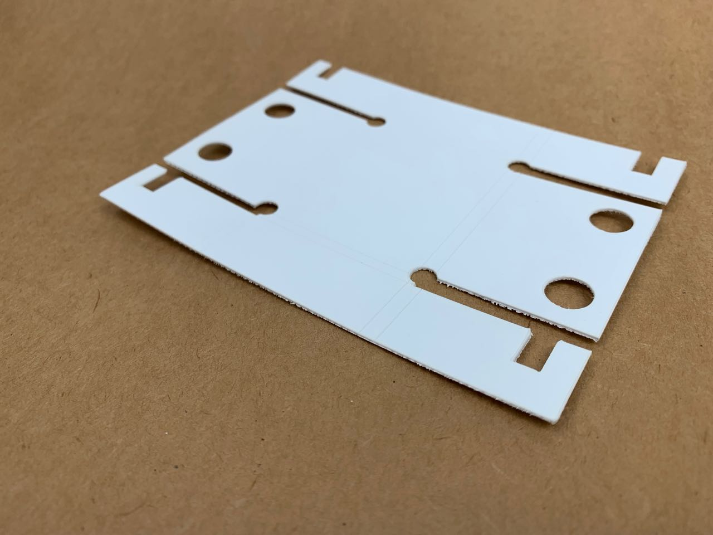

# Polypropylene (0.8 mm) — Cutting and Scoring 
Polypropylene sheet is a promising material for fabrication. It’s flexible and bends smoothly, but can also be scored and creased to form a sharp edge. It’s slightly textured on one side, which helps hide imperfections and gives it a soft matte sheen.

The material I have is the [flexible sheet, 0.8 mm thick](https://www.seawhite.co.uk/Catalogue/SURFACES-MOUNTING/Modelling-Board-Sheet/Polypropylene/A2-Polyproylene-Sheet-POLYPRO-2).

## Laser cutting tests

A surprising amount of power is needed to laser it.
Features smaller than 1 mm across (the small tabs in the picture) tend to melt and deform.
It scores very well. 

After many tests, gradually increasing the power of the laser, I’ve found these settings work adequately, though it has an unpleasant rough melted edge where cut, so maybe this could be improved.

### Cutting

|   Speed   |  50 %   |
|   Power   |  90 %   |
| Frequency | 5000 Hz |

### Scoring

|   Speed   |  50 %   |
|   Power   | 20-30 % |
| Frequency | 5000 Hz |

